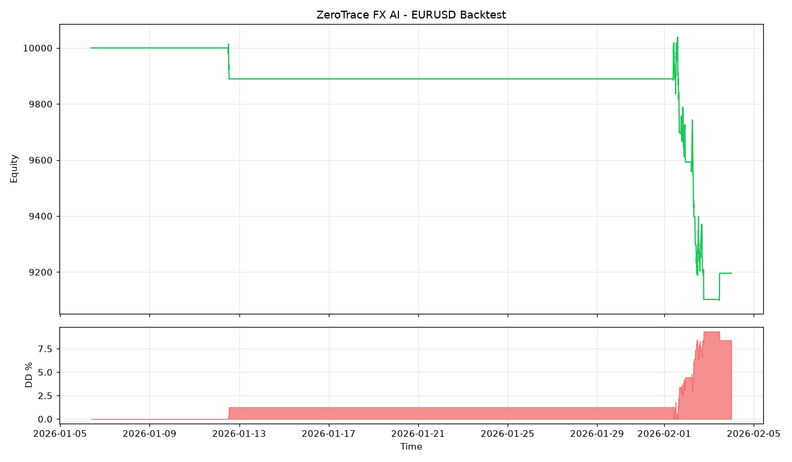
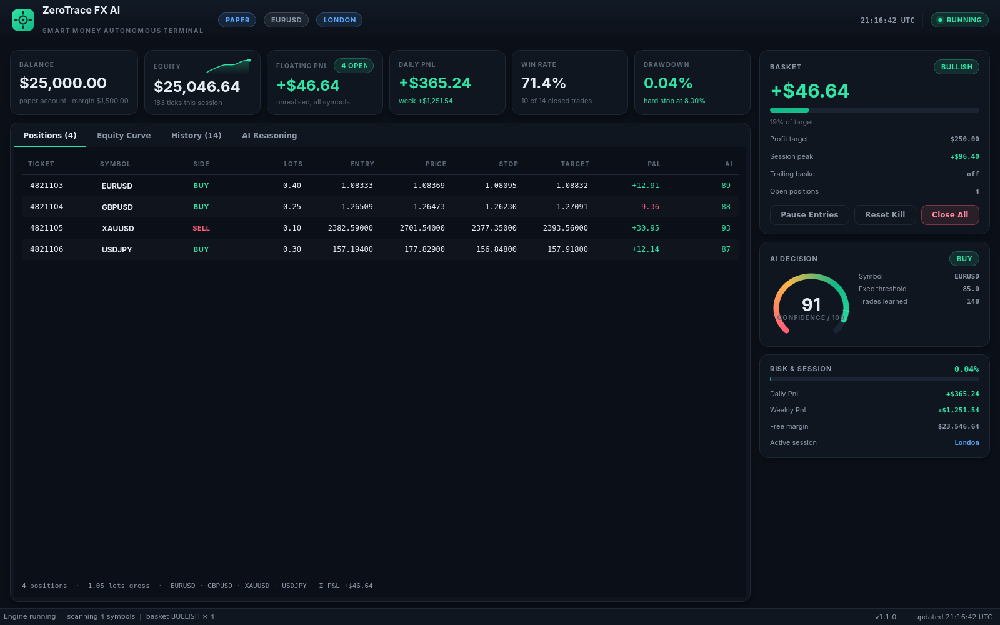

# ZeroTrace FX AI

**Institutional Smart Money Autonomous Forex Trading Platform**

[](https://github.com/diamantmuqici-dotcom/ZerotraceFx-Ai-Trading-/actions/workflows/ci.yml)
[](https://github.com/diamantmuqici-dotcom/ZerotraceFx-Ai-Trading-/actions/workflows/release.yml)


ZeroTrace FX AI is an institutional-grade autonomous trading system for
MetaTrader 5. It reads multi-timeframe Smart Money order flow, scores every
setup with an explainable AI confidence engine, manages multi-position
baskets with instant take-profit, and protects capital with layered risk
controls — in live, paper and backtest modes that all share one strategy core.

## Screenshots

Backtest report pipeline running on the bundled synthetic demo data
(`data/sample_EURUSD_M5.csv`) — this validates the engine end-to-end and is
**not a performance claim**. Always backtest on your own broker's history.



The Windows desktop app ships a dark institutional terminal — KPI strip
(balance, equity, floating/daily PnL, win rate, drawdown), basket control
panel with target progress, AI confidence gauge with per-rule reasoning,
live equity + drawdown charts, positions and trade history — that launches
directly from `ZeroTraceFXAI.exe`.



Want to see the terminal without installing MetaTrader 5? Run the simulated
preview (same widgets, synthetic feed):

```powershell
python -m dashboard.demo                 # animated preview
python -m dashboard.demo --screenshot out.png --size 1600x1000
```

## Features

- **Adaptive learning** — the AI learns from every trade it closes: component
  weights, per-symbol confidence thresholds and session edge adapt over time
  and persist across restarts (`python main.py ai` shows the memory).
- **Android companion app** — monitor and control the engine from your phone
  (see [docs/MOBILE.md](docs/MOBILE.md)).
- **Smart Money Concepts engine** — fractal swings (internal + external), BOS /
  CHoCH, order blocks, fair value gaps, liquidity sweeps, equal highs/lows,
  supply/demand zones, premium/discount — all candle-based with mitigation and
  invalidation tracking.
- **Multi-timeframe stack** — D1 macro, H4 primary, H1 structure, M15 setup,
  M5 execution. No single-timeframe entries, ever.
- **AI decision engine** — 11 weighted components produce a 0–100 confidence
  score with full reasoning; default execution threshold 85.
- **Basket trading** — treat every position as one basket; instant close-all
  at the profit target plus optional trailing-basket mode.
- **Institutional risk** — 1% dynamic sizing, ATR stops, min RR 1:2,
  break-even, trailing stop, partial TP, exposure caps, daily/weekly/drawdown
  limits, consecutive-loss lock, spread/latency filters, kill switch.
- **News + session filters** — economic-calendar blackouts and UTC session gates.
- **Robust MT5 execution** — reconnect, spread guard, retries, verification,
  partial close, pending orders, latency logging.
- **Paper trading** — identical interface with spreads, commission and slippage.
- **Backtesting suite** — event-driven simulator, Sharpe/Sortino, Monte Carlo,
  walk-forward optimisation, equity/drawdown charts.
- **Enterprise logging** — rotating app/trades/errors/execution/performance
  logs plus a JSONL + CSV trade journal.

## Quickstart

### Windows executable

1. Download `ZeroTraceFXAI-vX.X.X-windows.zip` from
   [Releases](https://github.com/diamantmuqici-dotcom/ZerotraceFx-Ai-Trading-/releases).
2. Extract, copy `.env.example` to `.env`, edit your settings.
3. Run `ZeroTraceFXAI.exe` — the dashboard opens and trading starts in PAPER mode.

### From source (Windows 10/11, Python 3.13)

```powershell
git clone https://github.com/diamantmuqici-dotcom/ZerotraceFx-Ai-Trading-.git
cd ZerotraceFx-Ai-Trading-
py -3.13 -m venv .venv
.\.venv\Scripts\Activate.ps1
pip install -r requirements.txt
copy .env.example .env
python main.py dashboard   # desktop UI
python main.py trade       # headless PAPER/LIVE loop
python main.py doctor      # why isn't it trading? gate-by-gate report
python main.py backtest --symbol EURUSD --csv data/sample_EURUSD_M5.csv
python -m pytest tests/ -q # ~100 tests, must be all green
```

See [`docs/INSTALLATION.md`](docs/INSTALLATION.md) for the full guide including
MetaTrader 5 setup.

## Configuration

Everything is configured through `.env` — no hardcoded trading values.
Key knobs: `ACCOUNT_MODE`, `SYMBOLS`, `CONFIDENCE_THRESHOLD`, `RISK_PERCENT`,
`BASKET_TARGET`, `BASKET_TRAILING_ENABLED`, `MAX_POSITIONS`, `MAX_TOTAL_LOTS`,
`SPREAD_LIMIT_PIPS`, `NEWS_FILTER_ENABLED`, `SESSION_FILTER_ENABLED`.

Full reference: [`docs/CONFIGURATION.md`](docs/CONFIGURATION.md).

## Project structure

```text
core/         domain types, event bus, runtime state, engine composition root
config/       .env settings, constants, offline instrument specs
market/       MT5 client, async data engine, indicators, sessions, news filter
smart_money/  swings, BOS/CHoCH, order blocks, FVGs, sweeps, zones
strategy/     MTF confluence, AI scorer, entry rules, SL/TP math
execution/    broker interface, live MT5 executor, retry/verify order manager
risk/         dynamic sizing, account protection, basket target + trailing
paper/        simulated broker (spreads, commission, slippage, SL/TP)
live/         realtime loop: signals → risk → fills → exits → basket
backtest/     simulator, metrics, Monte Carlo, walk-forward, charts
dashboard/    PySide6 dark desktop UI + view-model
utils/        rotating logs, math/time helpers, trade journal
tests/        ~100 unit + integration tests
docs/         installation, architecture, strategy, configuration guides
```

Strategy doctrine: [`docs/STRATEGY.md`](docs/STRATEGY.md) ·
System design: [`docs/ARCHITECTURE.md`](docs/ARCHITECTURE.md) ·
Changes: [`CHANGELOG.md`](CHANGELOG.md)

## Building the executable

```powershell
pip install pyinstaller
pyinstaller --noconfirm zerotrace.spec
# dist\ZeroTraceFXAI\ZeroTraceFXAI.exe
```

Tagged pushes (`v*`) build and publish the `.exe` automatically via the
`Release` workflow.

## Risk disclaimer

Trading foreign exchange on margin carries a high level of risk and may not be
suitable for all investors. Past (or simulated) performance is not indicative
of future results. This software is provided for educational and research
purposes under the MIT license, without warranty of any kind. Always validate
on demo accounts before considering live capital.

## License

MIT — see [LICENSE](LICENSE).
