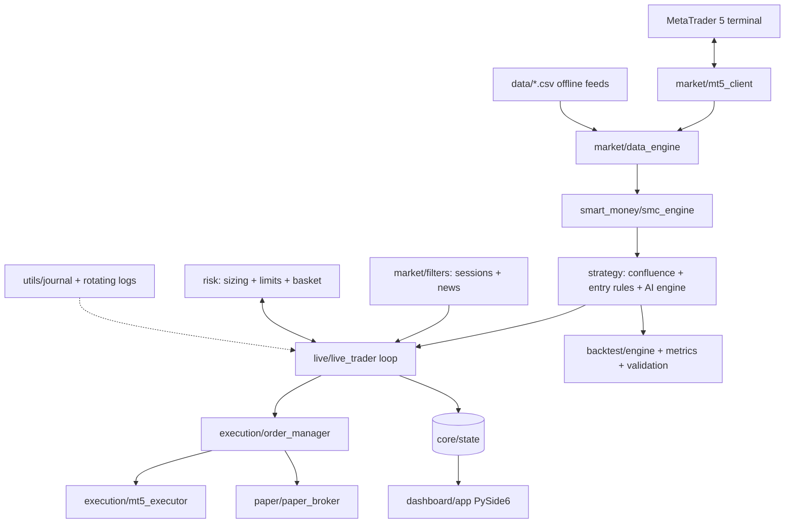

# Architecture — ZeroTrace FX AI

Async, modular, strictly-typed Python. Each package owns one concern and talks
to the others through `core/types.py` (shared domain models) and `core/events.py`.

## Package responsibilities

| Package | Owns |
|---|---|
| `core` | Domain types, event bus, runtime state, engine composition root |
| `config` | `.env` settings (pydantic-settings), constants, offline specs |
| `market` | MT5 client, async data engine, indicators, sessions, news filter |
| `smart_money` | Swings, BOS/CHoCH, order blocks, FVGs, sweeps, zones, dealing range |
| `strategy` | MTF confluence, AI 0–100 scorer, entry checklists, SL/TP math |
| `execution` | Broker interface, live MT5 executor, retry/verify order manager |
| `risk` | Dynamic sizing, account limits/kill switch, basket target + trailing |
| `paper` | Simulated broker (spreads, commission, slippage, SL/TP) |
| `live` | Realtime loop: signals → risk → fills → exits → basket |
| `backtest` | Event-driven simulator, metrics, Monte Carlo, walk-forward, charts |
| `dashboard` | PySide6 dark UI + view-model (Windows runtime) |
| `utils` | Rotating logs, math/time helpers, JSONL+CSV trade journal |

## Key design decisions

- **One strategy core, three venues.** `Strategy.analyze_data()` is synchronous
  and venue-free; live, paper and backtest all call it, so tested behaviour is
  traded behaviour.
- **Graceful degradation.** Missing MT5, thin history (macro-TF fallback),
  wide spreads and news blackouts degrade to HOLD/skip — never to guesses.
- **Basket-first loop.** Every cycle checks the basket target *before* new
  signals, so a hit target closes everything instantly.
- **Everything audited.** Signals, fills, closes, basket events and AI
  component scores land in the journal and rotating logs.
